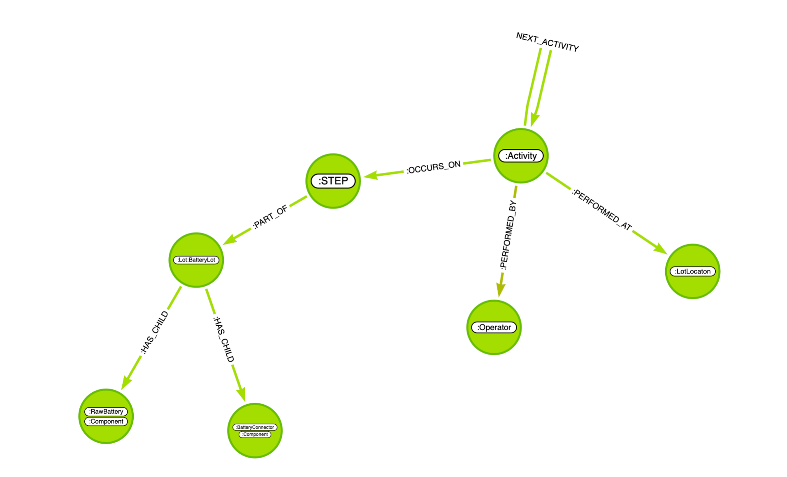
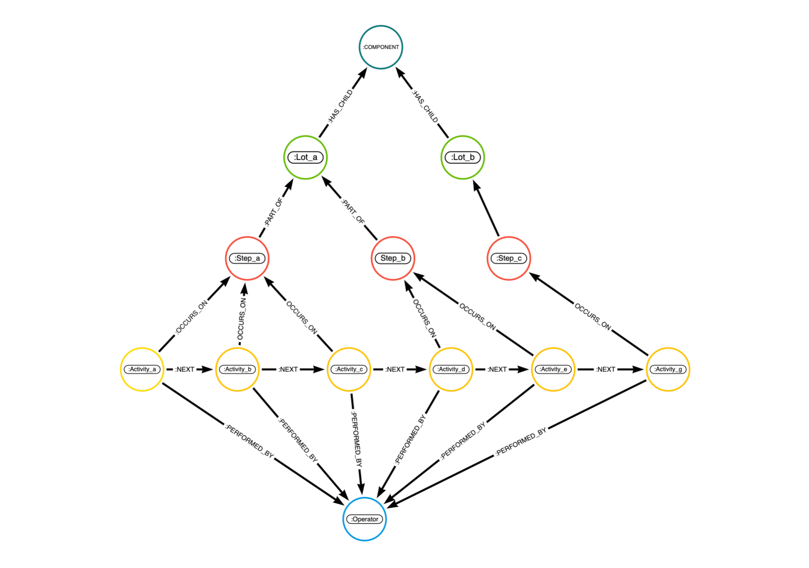

# Medtronic Supply Chain Graph

## Introduction

This README provides an overview and detailed instructions for setting up and utilizing a Neo4j graph database. This database is tailored for Medtronic's supply chain, focusing on the manufacturing process of batteries and wafers. The graph models various entities like activities, lots, products, steps, operators, components, and their relationships.

## Database Schema

### Node Types

1. **Activity**: Represents each activity in the manufacturing process.
2. **Lot**: Denotes lots of products, including Battery Lots.
3. **Product**: Represents different products in the supply chain.
4. **Step**: Denotes individual steps in the manufacturing process.
5. **Operator**: Represents personnel involved in the process.
6. **Component**: Represents components like Raw Battery, Battery Connector, etc.
7. **LotLocation**: Indicates the location of different lots.

### Relationships

- **Activity Sequence**: Linked list of activities (`:NEXT`).
- **Step to Lot**: Relationship between steps and lots (`:PART_OF`).
- **Activity to Step**: Mapping activities to their respective steps (`:OCCURS_ON`).
- **Activity to Operator**: Links activities to the operator performing them (`:PERFORMED_BY`).
- **Activity to LotLocation**: Indicates where an activity was performed (`:PERFORMED_AT`).
- **Component to Lot**: Links components to lots (`:HAS_CHILD`).

### To Build: run statements in the `/cypher` directory in a neo4j browser session.

* Source files are found in GCP Bucket: `neo4j-se-team-201905/neo4j-se-fournier/medtronic`

### Data models

